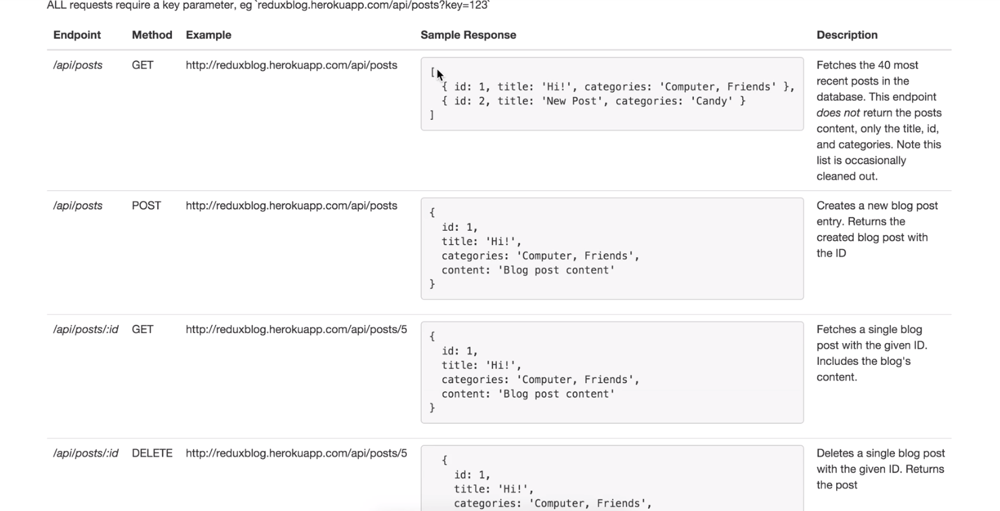

# React Redux Application Examples

## Description

Small apps with React, Redux on my learning journey to React master >_<

## Install

- Clone this repo `git clone...` 
- Go to the target folder `cd...` 
- Install dependencies `npm install`
- Run server `npm start`

## Apps

### [Weather](./weather/) 


- Practice get request with React, by quering from openweathermap.org
- Newly installed dependencies:

```bash
npm install --save axios // a lib for ajax call
npm i --save react-sparklin@1.6.0// show  small charts
npm install --save react-google-maps // integrating google map

```

### [Blog](./blog/) 



- Practice get | post | delet request and routing with React, Redux, axios by quering above api
- Newly installed dependencies:

```bash
npm install --save reac-router-dom 
npm install --save redux-form // form validation

```

### [Queue](./ep-Re)

- Epicodus course project

### [Personal home page v2.0](./php2)

- A blog with Gatsby-React-GraphicQL
- [Live Demo](adrianawritescode.com/blog)

## Known Bugs

- There are some, but I will try to fix them later

## Technologies Used

- React
- Redux
- Webpack

## Credits

- Some code credits go to their respective teachers/authors